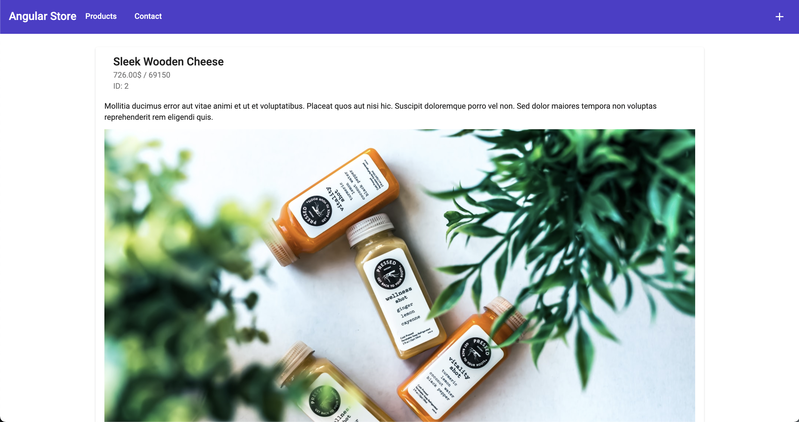
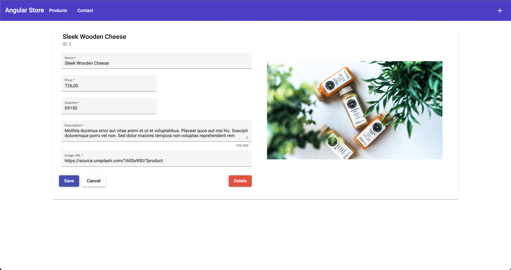
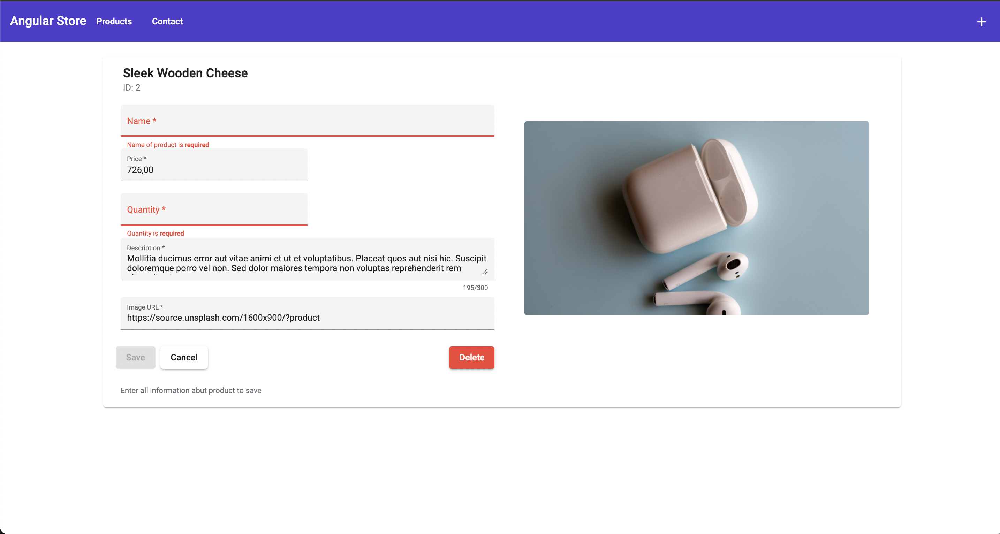
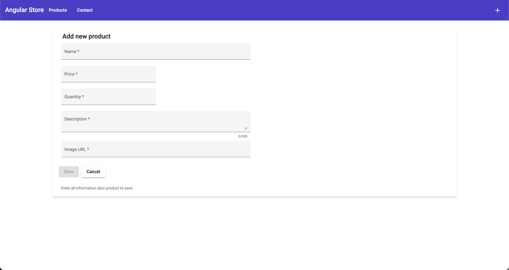
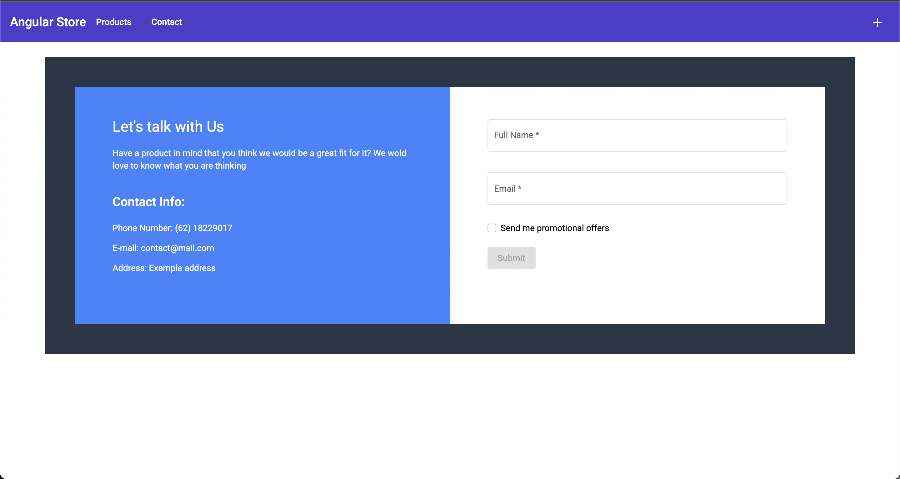
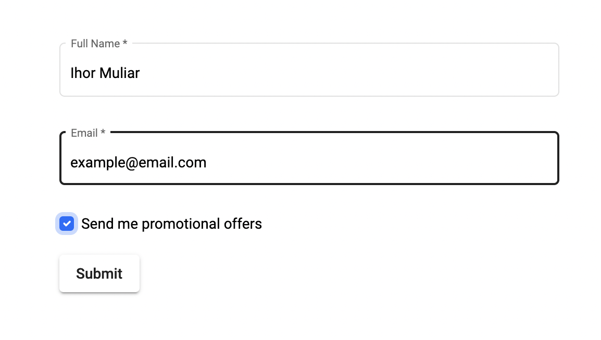
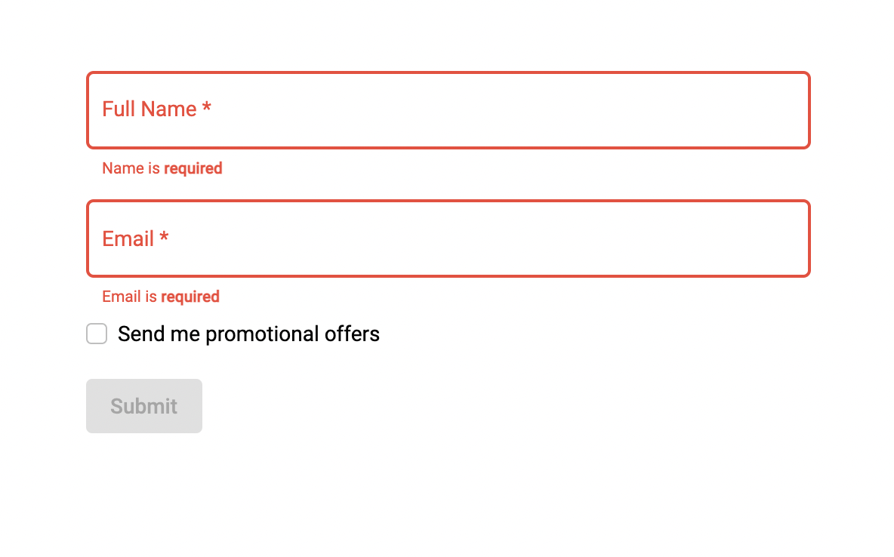

# SimpleSpa

This project was generated with [Angular CLI](https://github.com/angular/angular-cli) version 13.1.3.

## Development server

Run `ng serve` for a dev server. Navigate to `http://localhost:4200/`. The app will automatically reload if you change any of the source files.

## JSON Server

Run `npm run server` for a local json server. Navigate to `http://localhost:3000/`. 

# Task:
- Simple SPA;
- Basic form processing;
- Basic routing;
- Basic interactivity.

## Pages

You can navigate between pages with top toolbar.

1. Product Page

    At the product page list all available products.

    In the product card, there is info like name, price, quantity, id, description, and image url.
    By clicking the edit button you will navigate to the edit product page.

2. Edit Product Page

    In the produt edit page you can edit info about product or just delete that product.
    There is form validation and visual feedback.
    After clicking the save button data will put on server `http://localhost:3000/products/id`.

3. New Product Page

    By clicking the create button you will push new product to the server and it will apear in the list.

4. Contact Page

    You can enter your name and email, check or uncheck the box for a subscription.
    If everything is valid, you can submit the form and data will post on server `http://localhost:3000/subscribers`.
    Otherwise, validator will show proper error and basic visual feedback.

